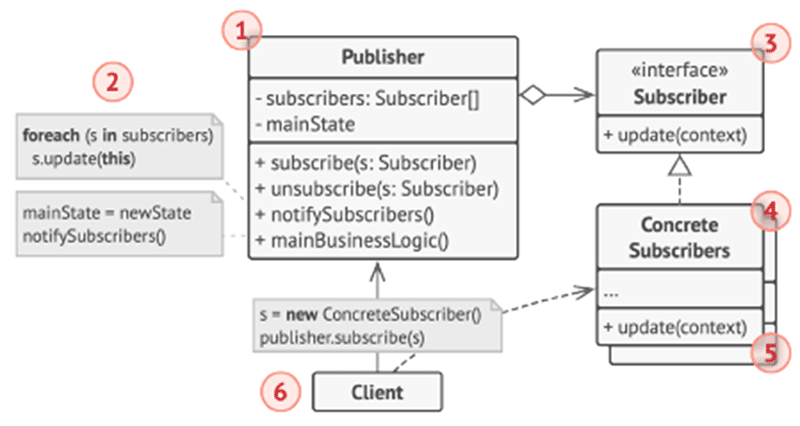

# Hands-on Design Patterns
***The Pizza Connection***

## Kapitel 08 - Observer-Pattern
### Änderungen zu Kapitel 07
Um unseren Pizza-Store etwas realistischer zu gestalten, habe ich das Projekt für uns noch etwas erweitert.

Die eigentliche Pizza-Herstellung wird jetzt von einem Thread-Pool abgewickelt🤘, und ist nebenläufig zur restlichen Anwendung. Um das besser zu verdeutlichen, benötigen die einzelnen Herstellungsschritte jetzt auch Zeit (die Threads warten etwas😴, um Arbeit zu simulieren).

Mehr Infos zu den Änderungen findet ihr weiter unten bei "Was ist neu?".

### Szenario
Mehr Kundschaft - mehr Wünsche. Um unseren Kunden die Wartezeit auf ihre Pizza🍕 möglichst angenehm zu gestalten, wollen wir transparenter werden. Dazu sollen alle in noch nicht fertiggestellten Pizzen in einer Warteschlagen-Anzeige dargestellt werden. Außerdem soll schneller zu sehen sein, welche Bestellungen abholfertig sind. Auch dafür wird eine Anzeige geschaffen.

### Was ist neu?

* `Pizza` kennt eine neue Eigenschaft `State`, die den Zustand der Pizza beschreibt: 
	* `QUEUED`: wartet darauf zubereitet zu werden
	* `IN_PREPARATION`: befindet sich beim Belegen
	* `IN_OVEN`: wird gerade gebacken
	* `DISH_UP`: wird angerichtet
	* `READY`: fertig zum Abholen

* `PizzaRepository`: eine Datenspeicherung für `Pizza`-Objekte

* `PizzaService`:
	* enthält jetzt ein Feld `pizzaKitchen` zur parallelen und asynchronen Pizza-Herstellung (basierend auf `java.util.concurrent.ExecutorService`)
	* der Service besitzt jetzt auch das `PizzaRepository` zum Speichern von Pizza-Bestellungen
		* `PizzaService.order()` 
			* speichert neue Pizzen im Repository
			* erzeugt neue `PizzaPreparationTask`s, die in der `PizzaKitchen` abgearbeitet werden
			* die Aufgaben `preparePizza()`, `logConsumedIngredients()`, `bakePizza()` und `servePizza()` finden im `PizzaPreparationTask` statt, und verbrauchen jetzt auch eine gewisse Zeit (schaue dir die Klasse in Ruhe an)
	* Der `Builder` des `PizzaService` wurde entsprechend angepasst

* `PizzaPreparationTask`: steuert die Pizza-Zubereitung

### Aufgabe

Im `PizzaController` sollen zwei neue REST-Endpunkte geschaffen werden:
* `/queue`: zeigt alle Pizzen die noch nicht fertiggestellt wurde. Eine Sortierung nach ID ist gewüscht.
* `/pick-up`: zeigt alle abholbereiten Pizzen an, ebenfalls nach ID sortiert.

_Verwendet das Observer-Pattern, um den Fortschritt zwischen `PizzaPerparationTask` und `PizzaService` auszutauschen. Das `PizzaRepository` soll dabei die "single source of truth" sein_ 😁

**Als kleine Hilfestellung hier nochmal das Pattern in UML:**



1. Der Publisher veröffentlich Ereignisse, die für andere Objekte von Interesse sind.
 
    Ereignisse treten ein, wenn der Publisher seinen Zustand ändert, oder bestimmte Verhaltensweisen ausführt.
    
    Enthält Liste an Subscribers zum Hinzufügen und Entfernen von Abonnennten.

1. Wenn ein neues Ereignis eintritt, geht der Publisher über die Abonnentenliste und ruft die Benachrichtigungsmethode (update) auf.

1. Die Schnittstelle Subscriber deklariert die Benachrichtigungsmethode. 

    In den meisten Fällen besteht sie aus einer einzigen Aktualisierungsmethode. Die Methode kann mehrere Paramter haben, mit denen den Publisher einige Ereignisdetails zusammen mit der Aktualisierung übergeben kann.

1. ConcreteSubscribers führen einige Aktionen als Reaktion auf die Benachrichtigungen des Publishers durch.
    
    Alle diese Klassen müssen dieselbe Schnittstelle implementieren, damit der Publisher nicht an konkrete Klassen gekoppelt ist.

1. Normalerweise benötigen Subscribers einige Kontextinformationen, um die Aktualisierung korrekt zu bearbeiten. Aus diesem Grund übergeben Publisher oft einige Kontextdaten als Argumente in der Benachrichtungsmethode.

1. Der Client erstellt Publisher- und Subscriber-Objekte und registriert dann Subscriber für Publisher Updates.

## **Viel Erfolg🍀 - ihr schafft das!**

----

### Maven verwenden

Um die Anwendung mit Maven zu bauen, verwendet ihr:
```
mvn clean compile
```
Zum Ausführen aller Tests:
```
mvn clean test
```
Zum Bauen der Anwendung als ausführbares JAR:
```
mvn clean install
```

#### Code Coverage
Wenn ihr Tests mit Maven ausführt, wird automatisch die Code Coverage mit ermittelt. Die Berichte findet ihr nach dem Build in `target/site/jacoco`. Öffnet `index.html` im Browser für eine Übersicht.