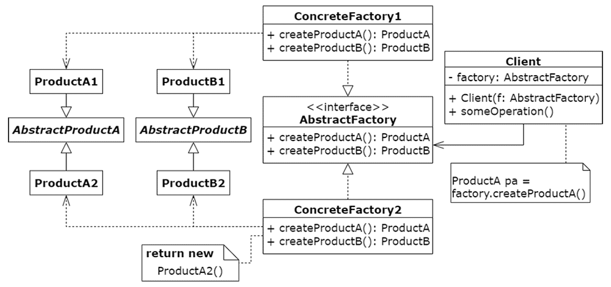

# Hands-on Design Patterns
***The Pizza Connection***

## Kapitel 03 - Abstract Factory
### Szenario
Unser Pizza-Business läuft besser als gedacht. Statt unserer normalen Pizza bieten wir jetzt eine Gourmet Pizza und eine Sicilian Pizza an, die es jeweils in den Sorten Cheese, Pepperoni und Veggie gibt. 

Sie unterscheiden sich im Teig und der verwendeten Tomatensoße.

* Sicilian
    * `ThinCrustyDough`
    * `PlainTomatoSauce`
* Gourmet
    * `HandTossedDough`
    * `PremiumTomatoSauce`

### Aufgabe
* Wende das Abstract-Factory-Pattern an, um unseren `PizzaService` in die Lage zu versetzen, das neue Angebot produzieren zu können.

* Ergänze alle noch fehlenden Testfälle.

**Wichtig:**
Einiges an Code habe ich bereits für dich angepasst und erstellt.
* neue Interfaces für `Ingredients`:
    * `Dough`, `Sauce`, `Cheese`, `Topping`
    * Die entsprechenden Klassen implementieren jetzt diese Interfaces
* die neuen Zutaten sind bereits vorhanden
* eine neue Enum `PizzaStyle`, die zwischen Sicilian und Gourmet unterscheidet
    * Im Bestellprozess kann der Kunde den Stil auswählen
* Es gibt bereits `SicilianPizzaFactory` und `GourmetPizzaFactory` als leere Rumpf-Implementierungen
* `PizzaService` enthält bereits die beiden neune Factories
* `PizzaService.order()` nimmt jetzt neben `MenuItem` auch `PizzaStyle` entgegen

*Hinweis:* diese Aufgabe ist ein größerer Umbau, nehme dir Zeit.

#### UML des Patterns


----

### Maven verwenden

Um die Anwendung mit Maven zu bauen, verwendet ihr:
```
mvn clean compile
```
Zum Ausführen aller Tests:
```
mvn clean test
```
Zum Bauen der Anwendung als ausführbares JAR:
```
mvn clean install
```

#### Code Coverage
Wenn ihr Tests mit Maven ausführt, wird automatisch die Code Coverage mit ermittelt. Die Berichte findet ihr nach dem Build in `target/site/jacoco`. Öffnet `index.html` im Browser für eine Übersicht.