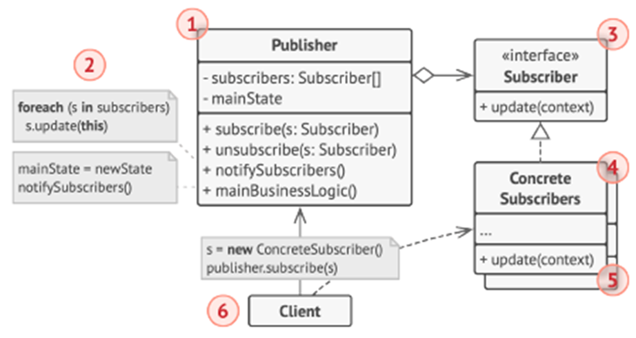

# Hands-on Design Patterns
***The Pizza Connection***

## Kapitel 05 - Decorator
### Szenario
🥳Das Geschäft boomt... Aber unser Einkauf hat immer größere Schwierigkeiten rechtzeitig die benötigten Waren nachzukaufen.

Deshalb wurde bereits vor einiger Zeit unser `PizzaService` erweitert. Nach dem Ausliefern jeder Bestellung, werden die verbrauchten Zutaten in einem `IngredientLogger` aufgezeichnet und beim Beenden der `PizzaStoreApp` einmal ausgegeben👏

Das kannst Du auch gerne einmal ausprobieren💻

Nun hat der Einkauf angemerkt, dass das zwar hilft, aber für eine schnelle Bearbeitung eine geordnetere List von Nöten wäre. Unglücklicherweise wurde der `IngredientLogger` schnell eingeführt, besitzt kein Interface und lässt sich damit schlecht austauschen🤔

Unser Chef-Entwickler hatte dazu eine Idee💡: "Lasst uns das Decorator-Pattern nutzten. Die Ausgabe erfolgt nur beim Beenden der App. Wir können das so mit wenig Aufwand lösen und den Einkauf glücklich machen..."

### Aufgabe
* Erstelle einen Decorator für `IngredientLogger`
* Verwende den neuen Decorator anstelle des `IngredientLogger` für die Ausgabe der verbrauchten Zutaten (`PizzaStoreApp`: Zeile 50)
* Passe die Ausgabe nach den Wünschen des Einkaufs an

**Anforderungen des Einkaufs:**

Die ausgegebene Einkaufsliste soll in 4 Teile unterteilt sein:
* Dough
* Sauce
* Cheese
* Toppings

Für jeden Teil soll eine verbrauchte Zutat nur einmal in der Liste erscheinen und mit der verbrauchten Menge ergänzt werden💪

_Beispiel:_
```
Dough:
    2x  thin crusty dough
    1x  hand tossed dough
Sauce:
    2x  plain tomato sauce
    1x  premium tomato sauce
Cheese:
    2x  mozzarella
    1x  Monterey Jack
Toppings:
    2x  artichoke hearts
    2x  black Kalamata olives
    2x  freshly sliced tomato
    1x  hot pepperoni
```

***Hinweis:*** Es wurde kein weiterer Code vorbereitet😢

### Das Pattern als UML


----

### Maven verwenden

#### Anwendung mit Maven kompilieren
* CMD (Windows): `mvnw clean compile`
* Shell (Linux/Git Bash/macOS): `./mvnw clean compile`

#### Ausführen aller Tests
* CMD (Windows): `mvnw clean test`
* Shell (Linux/Git Bash/macOS): `./mvnw clean test`

Wenn ihr Tests mit Maven ausführt, wird automatisch die Code Coverage mit ermittelt. Die Berichte findet ihr nach dem Build in `target/site/jacoco`. Öffnet `index.html` im Browser für eine Übersicht.

#### Bauen der Anwendung als ausführbares JAR
* CMD (Windows): `mvnw clean install`
* Shell (Linux/Git Bash/macOS): `./mvnw clean install`

Wenn die Anwendung als ausführbares JAR gebaut wurde, kann sie mit dem Launch-Script gestartet werden. Dazu gebt ihr im Basisverzeichnis des Projekts folgendes ein:
* CMD (Windows): `launch`
* Shell (Linux/Git Bash/macOS): `./launch`